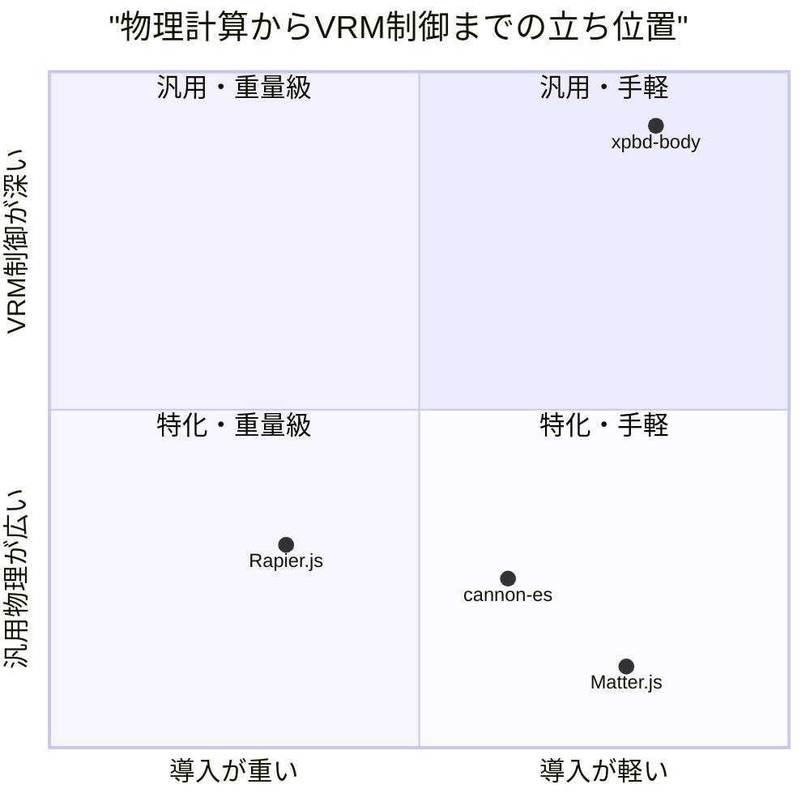
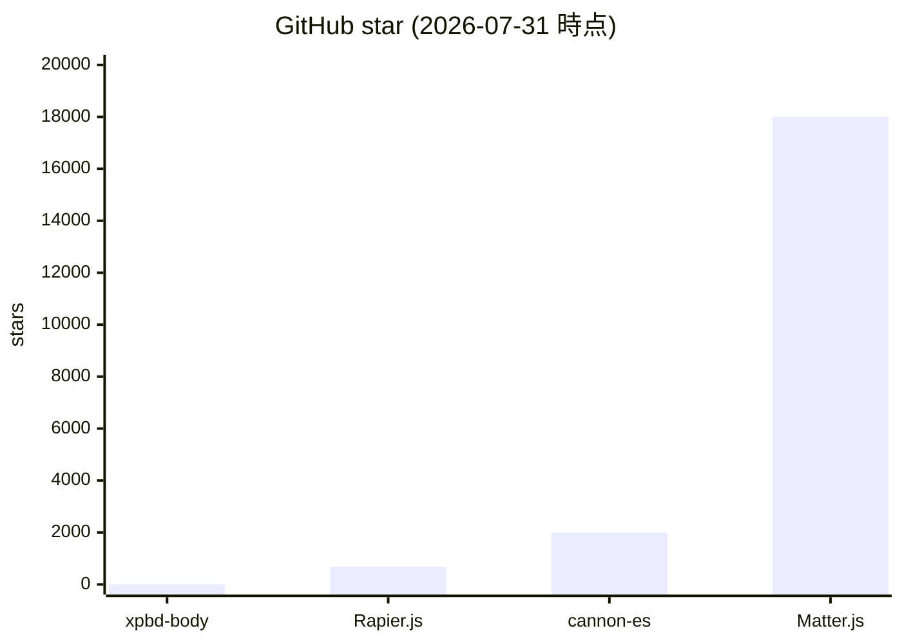
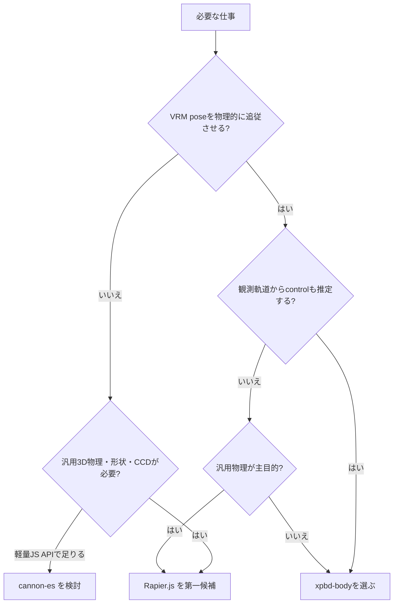

# 0. 要約

立ち位置: `xpbd-body` は汎用物理エンジンではなく、motion-engine の目標ポーズを質量・重力・接触つきの VRM 上半身へ変換し、さらに制御を逆推定する小型 engine である。

最大の弱点: 汎用衝突形状、摩擦、関節制限、性能実績、利用者数では Rapier 等に大きく及ばず、人体向けの物理量もまだ engine 単位で未較正である。

次の一手: 汎用機能を追わず、VRM ボーン入力→物理追従→逆動力学→決定論的リプレイという狭い縦切りを、動くデモ・ベンチ・motion-engine/keiko-engine 統合で製品価値として固定する。

# 1. このrepoは何か

## 一言

VRM 上半身の目標ポーズを、XPBD 制約で動的な active-ragdoll にする JavaScript engine である。`index.js` は `World`、`Body`、`Attach`、`Motor`、接触制約、`makeArm`、`makeUpperBody` を提供し、`inverse.js` は `snapshot` / `restore`、前向き `simulate`、`estimateControl` を提供する。

## 提供価値

前段の [motion-engine](https://github.com/opaopa6969/motion-engine) が作る運動学的な目標ポーズを、質量・重力・接触・筋肉の柔らかさを持つ物理状態へ落とす。弱い筋肉なら垂れ、押されれば反応し、接触を守る。M4 では観測軌道から、可動域・トルク上限・残差を prior にした制御推定も行う。したがって、価値を出す単位は repo 単体の剛体計算ではなく、`motion-engine → xpbd-body → VRM renderer`、逆向きには観測軌道 → `xpbd-body/inverse` → `keiko-engine` の組み合わせである。

## 想定利用者

VRM アバターの動きを物理的に見せたい開発者、決定論的なリプレイを必要とするモーション生成・解析の開発者である。汎用ゲーム物理の利用者を主対象にはしていない。

## 到達点の客観指標

調査時 HEAD は `3190b73`、package version は `0.4.0`。`index.js` 341 行、`inverse.js` 496 行、テスト 391 行、公開 export は 28（index 14 + inverse 14）、runtime dependency は 0。`npm test` を Node で実行し **48 passed / 0 failed**。npm 公開状況はこの調査では確認できなかったため、分からない。

README と実装・設計 docs を突き合わせると、M1〜M3 の前向き active-ragdoll に加えて M4 の逆動力学まで実装済みである。README の「小さな XPBD」とだけ読むより、実態は VRM 専用の制御・推定層まで含む engine と捉えるのが比較上正確である。

# 1.5 調査の型

`engine`。生成物を作るエンジンではなく、物理状態を更新するライブラリだが、利用者が選ぶ単位は単なる `Body` API ではなく、目標ポーズを入力して動的な身体を得る制御エンジンである。したがって API 設計（宣言的な pose/control 入力、compliance、snapshot、決定論、拡張制約）を主軸に比較した。比較対象のコードは公開 package/source と API 構造を確認したが、巨大な生成バインディングの全 API を同じ基準で数え上げるところまではできなかったため、confidence は「中」とする。

# 2. 比較対象と選定理由

| 製品 | 何ができるか | 採用状況 | ライセンス | うちとの決定的な違い | なぜ比較対象に選んだか |
|---|---|---|---|---|---|
| Rapier.js / `@dimforge/rapier3d` | Rust ベース Rapier の JS/WASM 3D 剛体・衝突・関節・CCD・クエリ。deterministic build もある | GitHub ★680（2026-07-31確認）／JS binding 最新 0.19.3（2025-11-05） | Apache-2.0 | 汎用性・性能・形状の広さが強い一方、VRM pose→muscle→inverse control は提供しない | 3D Web で最も本格的な既製物理基盤であり、自作を捨てられるかの第一候補 |
| cannon-es | TypeScript の軽量 3D 剛体物理。形状、制約、摩擦、sleep、trigger 等 | GitHub ★2.0k（2026-07-31確認）／v0.20.0（2022-08-12） | MIT | JS だけで扱いやすいが、目標ポーズを compliance つき筋肉として扱う層はない | 小規模 Web/three.js の近い導入体験と比較するため |
| Matter.js | Web 向け 2D 剛体物理。デモ・Canvas 連携・プラグインが豊富 | GitHub ★18k（2026-07-31確認）／npm v0.20.0（公開 package で確認） | MIT | 2D なので VRM 上半身の候補ではないが、導入容易性と普及の基準になる | 「物理エンジンとして選ばれる」ための UX・普及面の上限を知るため |

この地図は、汎用物理の市場と、VRM 用の制御・推定層が分離していることを示す。Rapier と cannon-es は `xpbd-body` の下層を置き換え得るが、上層の active-ragdoll semantics は別実装になる。Matter.js は機能上の代替ではなく、軽い導入とデモが採用を作るという別の競争軸の比較対象である。`xpbd-body` が汎用物理の star 数で勝つ地図ではない。

# 3. ポジショニング

軸は「既存プロジェクトへ導入して動かす手間」と「汎用物理ではなく VRM 制御に踏み込んでいる度合い」である。位置は機能表・package構造・README に基づく定性的な整理で、性能や採用数を座標化したものではない。

# 4. 機能比較

| 機能 | 重み | xpbd-body | Rapier.js | cannon-es | Matter.js |
|---|---:|---|---|---|---|
| 3D 剛体・重力 | ◎必須 | ○ | ○ | ○ | × |
| VRM 上半身の既定構成 | ◎必須 | ○ | × | × | × |
| 目標 pose を compliance つき motor で追従 | ◎必須 | ○ | △（PID等を組む） | △（constraint/force を組む） | × |
| 接触・自己衝突 | ◎必須 | ○（sphere/AABB/ground） | ○（多数形状・CCD） | ○（多数形状） | ○（2D） |
| 摩擦 | ○効く | ×（roadmap） | ○ | ○ | ○ |
| 関節可動域制限 | ◎必須 | △（inverse prior、XPBD constraint はroadmap） | ○ | ○ | △ |
| 決定論的 replay | ◎必須 | ○（固定 substep、乱数なし） | △（deterministic variant あり） | △（同一環境前提） | △（同一環境前提） |
| snapshot / restore | ◎必須 | ○ | ○（snapshot機能） | △（ユーザー側実装） | △（ユーザー側実装） |
| 観測軌道から control 推定 | ◎必須 | ○（gradient-free） | × | × | × |
| 物理量の人体較正 | ○効く | ×（engine units） | × | × | × |
| 依存なし・headless Node | ○効く | ○ | △（WASM） | ○ | ○ |

この表で最も痛い差は、汎用物理の機能数ではなく、`xpbd-body` の◎である pose-to-control と inverse control が既製品にはない点である。逆に摩擦、複雑な形状、厳密な joint limit は現時点で本当に不足しており、VRM の見た目を壊す接触場面が増えると弱点になる。決定論は `xpbd-body` の差別化だが、既製エンジンにも限定的な deterministic 選択肢があるので、単独では十分な moat ではない。

# 4.5 コード・実装の比較

| 観点 | xpbd-body | Rapier.js | cannon-es | Matter.js | 出典・測定方法 |
|---|---:|---|---|---|---|
| 公開 API 数 | 28 export（14 + 14） | 未正規化 | 未正規化 | 未正規化 | 自repo `rg '^export '`。比較対象は生成型/namespace型で、同じ定義の機械集計を今回できなかった |
| runtime 依存数 | 0 | 0（npm `@dimforge/rapier3d` 表示） | package の runtime dependencies 記載なし | package の runtime dependencies 記載なし | 各 package.json。devDependencies は含めない |
| テスト実行 | 48 passed / 0 failed | この調査では未実行 | この調査では未実行 | この調査では未実行 | `npm test` の実行結果。比較対象をインストールして同一条件で走らせてはいない |
| 配布サイズ | `files` 43.5 KB（index.js + inverse.js + package/LICENSE） | 3D package は WASM。正確な unpacked size は未計測 | dist 配布。正確な unpacked size は未計測 | build/matter.js と min.js。正確な unpacked size は未計測 | 各 package.json と自repo `du -h`。未計測値を推測しない |
| ライセンス制約 | MIT | Apache-2.0（NOTICE/ライセンス保持条件） | MIT | MIT | LICENSE / package.json |

`xpbd-body` の実装上の強みは、依存ゼロ・約1,200行・テスト可能な純粋なデータモデルである。Rapier は WASM と生成 binding の導入を受け入れる代わりに、形状・性能・クエリを買う設計で、cannon-es は型付き汎用 API、Matter.js はデモと Web UX に重心がある。ここで比較対象の API 数や配布サイズを未計測にしたのは、数字を埋めるために「クラス数」や「minified bytes」を別基準で混ぜると判断を誤るためである。次回は同一 npm pack・同一 export 抽出スクリプトで正規化すべきだ。

# 5. 採用状況

自repo の GitHub star はこの調査で API 取得できなかったため 0 は「0 stars」ではなく「未確認」を意味する。このため図の数値比較としては不完全であり、採用判断の根拠には使わない。確認できた範囲では Matter.js / cannon-es の普及差は大きいが、star は VRM 制御への適合度ではない。

# 5.5 調査者の見立て

本当の勝負所は、XPBD の solver 自体ではなく「観測された動きを、質量・接触・筋力制限を持つ制御へ変換できる」ことだと読む。汎用 solver は Rapier に置き換えられるが、pose/control の schema と `feasible` / `residual` を持つ inverse API は、この repo の狭い価値である。

数字に出ていない懸念は、engine units の torque/compliance が人体に較正されていないことと、摩擦・joint limit が未実装なことだ。テストの通過は回帰には強いが、VRM の見た目や実ユーザーの入力に対する妥当性はまだ証明していない。

自分なら、汎用物理機能を増やす前に `motion-engine` から一つの VRM 動作を通し、同じ入力を replay し、逆推定の residual と見た目を並べる end-to-end fixture を公開する。これが採用理由を一番短く伝える。

この見立てが外れるとしたら、利用者が実際には inverse dynamics ではなく、複雑な環境衝突や高性能な大量剛体を求めている場合である。その場合は Rapier を下層に採用し、`xpbd-body` を pose/motor/inverse の薄い上層へ縮める判断が正しくなる。

# 6. 提案（優先順）

| 順 | 提案 | 分類 | 根拠 | 最小の一手 | 効きそうな指標 |
|---:|---|---|---|---|---|
| 1 | motion-engine → xpbd-body → VRM の end-to-end デモと deterministic replay fixture を追加する | 伸ばす | ◎の pose 追従と決定論が repo 固有の価値 | 1動作・固定 seed/入力・出力 hash・動画または gif を docs に置く | 初回導入時間、同一入力の hash 一致、デモ完走率 |
| 2 | `inverse` の評価データセットと品質指標を固定する | 伸ばす | inverse は決定的な差別化だが、現状は synthetic round trip が中心 | ノイズ量・遮蔽・接触ありの3ケースで residual / feasible / control error を記録 | control error、false feasible、処理時間 |
| 3 | 摩擦と joint limit を、既存の XPBD constraint として実装する | 埋める | 機能表の◎/○の欠落で、接触動作のリアリティに直結 | まず ground friction と elbow ROM の2制約を追加し、回帰テストを作る | 滑り量、ROM違反、既存48テストの維持 |
| 4 | 物理量の人体較正を「仕様」として明記し、代表体格の profile 校正を行う | 埋める | docs 自身が engine units と未較正を認めている | mass / bulk / compliance / maxTorque の1 profileを実測基準で固定 | target tracking error、sag angle、torque range |
| 5 | Rapier を optional backend として検討する | 埋める | 複雑な形状・CCD・性能は自前実装の負債になりやすい | APIを `Body/Contact` と solver backend の境界で小さく spike する | 同一シーンの速度、接触安定性、bundle size |
| 6 | 汎用形状・車両・大量剛体・レンダラーを自前で追いかけない | やらない | Rapier/cannon-es が既に優位で、VRM制御の差別化を薄める | roadmap から汎用機能を増やす項目を除外し、必要時は backend 化する | VRM end-to-end の導入時間、機能追加の回帰量 |

# 7. 選択の分岐

`xpbd-body` を選ばない条件を明確にすると、VRM の pose/control schema と inverse feasibility が不要で、複雑な衝突形状・CCD・大量剛体・性能が主目的の場合である。その場合は既製の Rapier または cannon-es を使い、`xpbd-body` を採用するのは「物理 engine を持つ」ためではなく「身体の制御意味論を持つ」ために限る。

# 8. 出典

| URL | 参照日 | 何の根拠に使ったか |
|---|---|---|
| `https://github.com/opaopa6969/xpbd-body` | 2026-07-31 | 自repo の README、公開 API、status、license、M4 の説明 |
| `https://github.com/opaopa6969/xpbd-body/blob/3190b734b1c96f80f0aabd11a986f41c777109f7/index.js` | 2026-07-31 | 自repo の実装、export、XPBD制約、接触、upper-body API |
| `https://github.com/opaopa6969/xpbd-body/blob/3190b734b1c96f80f0aabd11a986f41c777109f7/inverse.js` | 2026-07-31 | snapshot/restore、simulate、estimateControl、feasibility の実装 |
| `https://github.com/opaopa6969/xpbd-body/blob/3190b734b1c96f80f0aabd11a986f41c777109f7/test.mjs` | 2026-07-31 | `npm test` を実行し 48 passed / 0 failed を確認 |
| `https://github.com/dimforge/rapier.js` | 2026-07-31 | star、構成、3D JS binding の位置づけ |
| `https://github.com/dimforge/rapier.js/blob/master/CHANGELOG.md` | 2026-07-31 | 0.19.3（2025-11-05）および deterministic / PID / CCD 等の公開変更 |
| `https://www.npmjs.com/package/@dimforge/rapier3d?activeTab=readme` | 2026-07-31 | version、license、runtime dependency 0、feature selection、WASM配布形態 |
| `https://github.com/pmndrs/cannon-es` | 2026-07-31 | star、latest release、3D feature、MIT、source tree、test tree |
| `https://raw.githubusercontent.com/pmndrs/cannon-es/master/package.json` | 2026-07-31 | version、license、files、scripts、依存構成 |
| `https://raw.githubusercontent.com/pmndrs/cannon-es/master/LICENSE` | 2026-07-31 | MIT 条項 |
| `https://github.com/liabru/matter-js` | 2026-07-31 | 2D engine の位置づけ、source/test tree、採用状況 |
| `https://raw.githubusercontent.com/liabru/matter-js/master/package.json` | 2026-07-31 | v0.20.0、license、build/test、配布 files、依存構成 |

比較対象の全コードを同じ条件で checkout して API 数・テスト数・pack サイズを機械測定するところまでは実施していない。そのため 4.5 節の未正規化項目を埋めず、confidence を「中」に留めた。次回の再調査では同じ Node/npm 環境で `npm pack --json`、root export 抽出、テスト実行を揃える。
